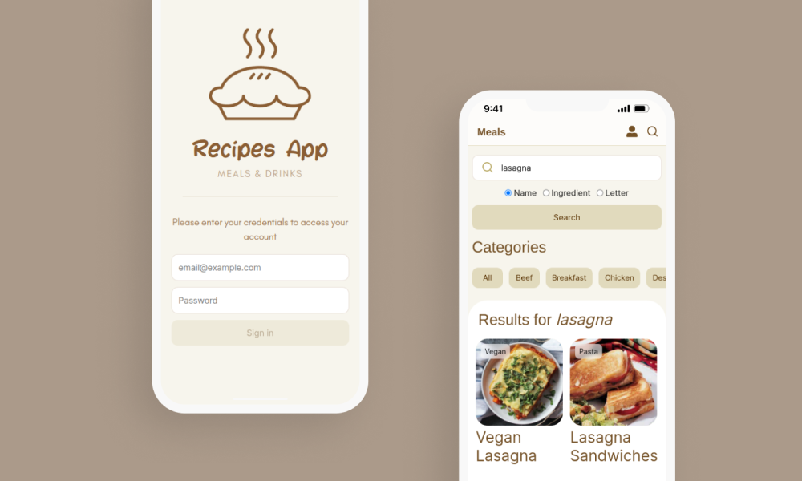
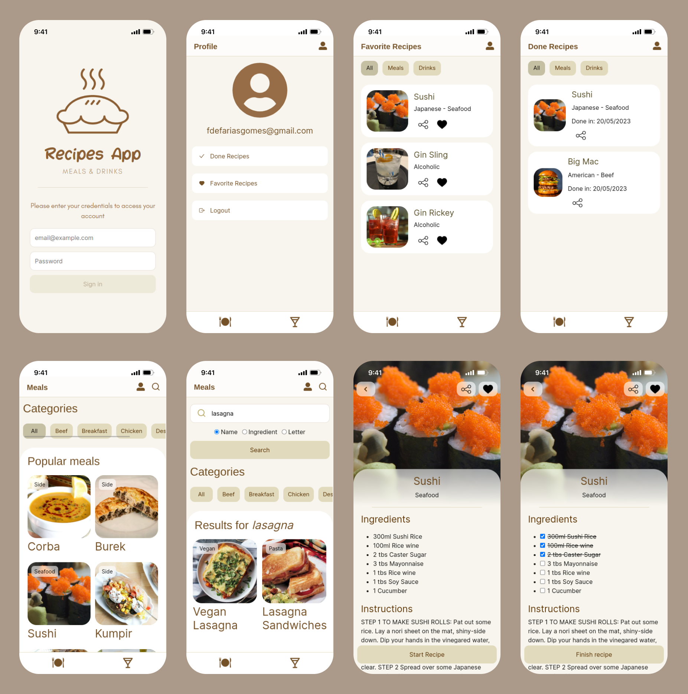

# recipes-app



Esse foi o último projeto desenvolvido duranto o módulo de front-end do curso de desenvolvimento web da [Trybe](https://www.betrybe.com/).

Foi construído em conjunto com os colegas de turma:

- [Murilo Batista](https://github.com/MuriloBatista)
- [Guilherme Lucena](https://github.com/Gui-lfm)
- [Felipe Favato](https://github.com/FelipeFavato)
- [Ismael Soares](https://github.com/ismasoares)

A proposta era construir um aplicativo de receitas utilizando as APIs [https://www.themealdb.com/api.php](https://www.themealdb.com/api.php) e [https://www.thecocktaildb.com/api.php](https://www.thecocktaildb.com/api.php), onde a pessoa usuária pudesse pesquisar por receitas de comidas e bebidas, favoritá-las, iniciar e acompanhar o progresso de preparo de uma receita.

Tivemos, no total, 9 dias para desenvolver a aplicação.

# Desenvolvimento

Após lermos, entendermos e conversarmos sobre os requisitos do projeto, optamos por dividir as tarefas individuais conforme as telas/componentes necessários para montar a aplicação. De maneira que cada um ficou responsável pela construção de uma pequena parte do projeto.

### Fui responsável por implementar:

- o componente _`Header.js`_;
- o componente _`SearchBar.js`_;
- a tela _`RecipeInProgress.js`_;
- a estilização _`(CSS)`_ da aplicação.

### Processo de _follow-up_ do progresso de desenvolvimento

Utilizamos o [Trello](https://trello.com/)  para registro e _follow-up_ de status de cada requisito. Fizemos, também, _daily meetings_, por meio do [Zoom](https://zoom.us/) , para atualizarmos o time sobre o progresso de desenvolvimento, alinhamento de metas e espectativas e comunicarmos à equipe eventualidades que pudessem nos impedir de cumprir o(s) prazos alinhados previamente. Para nos comunicarmos assicronamente utilizamos o [Slack](https://slack.com/intl/pt-br) .

## Tecnologias utilizadas

- React ;
- ContextAPI para o gerenciamento de estados ;
- RTL para os testes unitários ;
- CSS para a estilização .

# Resultado final

Confira a aplicação funcionando em: [https://recipes-app-fdfgomes.web.app/](https://recipes-app-fdfgomes.web.app/)



<br />

# Rodando o projeto localmente

O primeiro passo é clonar o repositório, em seguida instalar as dependências do projeto:

```
git clone git@github.com:fdfgomes/TRYBE-recipes-app.git
cd TRYBE-recipes-app
npm install
```

#### Feito isso, para **inicializar o servidor de desenvolvimento**, utilizar o comando:

```
npm start
```

#### Para executar os testes unitários utilizar o comando:

```
npm test
```
