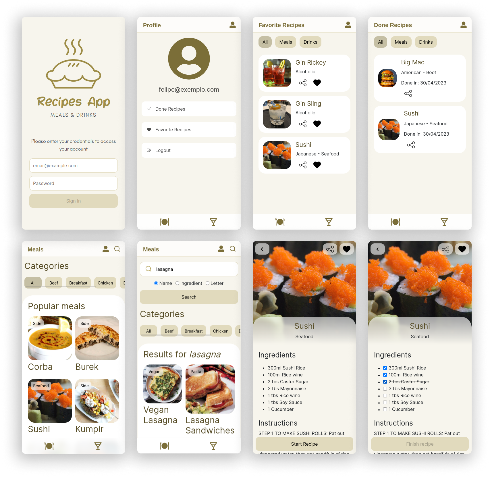

# recipes-app

Esse foi o último projeto desenvolvido duranto o módulo de front-end do curso de desenvolvimento web da [Trybe](https://www.betrybe.com/).

Foi construído em conjunto com os colegas de turma:

- [Murilo Batista](https://github.com/MuriloBatista)
- [Guilherme Lucena](https://github.com/Gui-lfm)
- [Felipe Favato](https://github.com/FelipeFavato)
- [Ismael Soares](https://github.com/ismasoares)

O objetivo era montar um aplicativo de receitas utilizando as APIs [https://www.themealdb.com/api.php](https://www.themealdb.com/api.php) e [https://www.thecocktaildb.com/api.php](https://www.thecocktaildb.com/api.php), onde a pessoa usuária pudesse pesquisar por receitas de comidas e bebidas, favoritá-las, iniciar e acompanhar o progresso de preparo de uma receita.

Tivemos, no total, 9 dias para desenvolver a aplicação.

## Desenvolvimento

Após lermos e entendermos os requisitos do projeto, nós dividimos as tarefas individuais conforme as telas e componentes necessários para montar a aplicação. De maneira que cada um ficou responsável pela construção de uma pequena parte do projeto.

#### Fui responsável por desenvolver:

- o componente _`Header.js`_;
- o componente _`SearchBar.js`_;
- a tela _`RecipeInProgress.js`_;
- toda a parte de estilização _`(CSS)`_ da aplicação.

#### _Follow-up_ do progresso de desenvolvimento

Utilizamos o [Trello](https://trello.com/) para registro e _follow-up_ do progresso de desenvolvimento de cada requisito. Fizemos também _daily meetings_, utilizando o [Zoom](https://zoom.us/), para atualizarmos a equipe sobre o que foi desenvolvido no dia anterior, alinharmos as metas e espectativas para o dia e comunicarmos à equipe alguma eventualidade que pudesse nos impedir de cumprir a(s) entrega(s) definidas(s) para o dia. Para nos comunicarmos durante o dia utilizamos o [Slack](https://slack.com/intl/pt-br).

## Stack utilizada

- React ;
- ContextAPI para o gerenciamento de estados ;
- RTL para os testes unitários .

# Resultado final

- [https://recipes-app-d90ff.web.app/](https://recipes-app-d90ff.web.app/)

